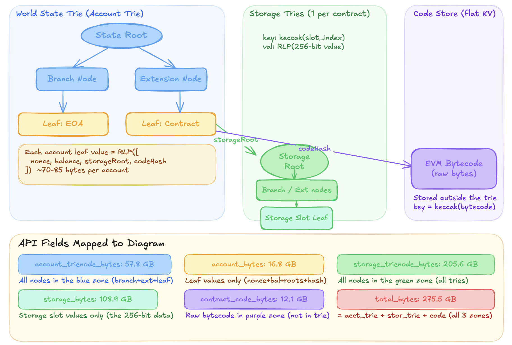

## About
- This repo is to get more granual state-related data only from [lab.ethpandaops.io](https://lab.ethpandaops.io/ethereum/execution/state-growth) to inform the size estimates in [this slicing](https://notes.ethereum.org/U9xM4VOPR9isPK7lOZJUQg?view#3-Ethereum-Data)
- Exclusion criteria informed by [this analysis](https://ethereum-magicians.org/t/not-all-state-is-equal/25508) eg dead or spammy contracts

**Current slicing into datasets (a tailored PIR engine per slice):**
- **`Express`**:  of highly manually curated data that is frequently queried. This includes: ETH/ERC* balances and asscoiated receipts like the ubiquitious ERC20 transfer receipts, and recent blocks. This data set serves users constructing common transactions or checking they received an expected transaction, and it serves to populate the first view in wallets where users expect to see their ETH and token transfers quickly.
- **`Small`**:  encompases (a) all account "header" data (balance,nonce,codehash,storageRoot) without exclusion and (b) contract bytecode.
- **`Medium`**:  encompases the nodes needed to construct Merkle roots validating account headers up to the global state root. This is useful for light clients verifications for example.
- **`Large`**:  encompases the both values and Merkle roots of storage. This is useful for verifiable ERC20 balances for example.
- **`Huge`**:  depending on the node and depending on what is pruned out based on similar criteria as those being considered for state expiry (dead code, ancient accounts, etc). It hosts the full archive of snapshots of the Ethereum state at every historical block serving both the values and the Merkle roots to proof them against the global state root at that snapshot in time.

### State Anatomy

### Field Mapping (as of Feb 26, 2026)

| API Field | Value | What It Measures |
|---|---|---|
| `account_trienode_bytes` | 57.8 GB | All nodes in the account trie (branch + extension + leaf) |
| `account_bytes` | 16.8 GB | Leaf values only — the RLP-encoded `[nonce, balance, storageRoot, codeHash]` across all 365M accounts |
| `storage_trienode_bytes` | 205.6 GB | All nodes across every contract's storage trie |
| `storage_bytes` | 108.9 GB | Storage slot values only (the 256-bit data) across 1.5B slots |
| `contract_code_bytes` | 12.1 GB | Raw bytecode in the code store (not in any trie) |
| `total_bytes` | 275.5 GB | `account_trienode_bytes` + `storage_trienode_bytes` + `contract_code_bytes` |

> **Note:** `total_bytes` is the sum of the three trie/store-level fields. The leaf-only fields (`account_bytes`, `storage_bytes`) are subsets of their respective `*_trienode_bytes` fields, not additive.

### Data Source

All data is fetched from the ethPandaOps Lab API endpoint `fct_execution_state_size_daily`, which reports daily snapshots of Ethereum mainnet state size extracted from a geth node.
